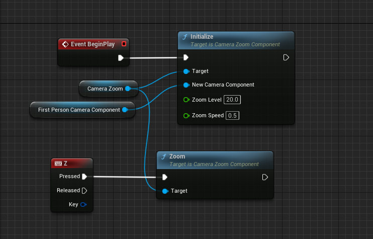

========================
Examples
========================

Following are some blueprint examples of the functionalities provided:

Bar Compass Widget
----------------------

This widget adds a bar compass with an indicator to the hud of the player. (The images used are sample images found online used only for representation purpose. Please use your own image)

**Usage**

Following is the blueprint code that uses the widget

**Output**

.. image:: https://i.imgur.com/lcVju9c.gif

Torch Component
----------------------

This adds a light source to the character. This works well as a effect only for a first person character.

**Usage**

Following is the blueprint code that uses the component

**Output**

.. image:: https://i.imgur.com/g9In6Ox.gif

Camera Zoom Component
----------------------

This Component Allows a character to toggle zoom in and zoom out. Add this component from the menu to the character.

**Usage**

Following is the blueprint code that uses the component

**Output**

.. image:: https://i.imgur.com/VZ7uvK3.gif

Time Dilation Component
----------------------

This Component allows users to create a time slow down effect while inversing the effect for the excluded actors giving the perception of time freeze or slow down.

**Usage**

Following is the blueprint code that uses the component. In this example the player character is allowed to move at normal pace while the other actors in the world are frozen.

**Output**

.. image:: https://i.imgur.com/5elS0io.gif

Redis Client
--------------

We have exposed the functionality of redis++ library via blueprint.

**Usage**

Following is a simple code that calls the increment function to increment value of an integer after connecting with redis. For testing purpose I ran a redis instance on "Windows Subsystem for Linux"

.. image:: features/images/CodeForRedis.PNG

Post running the blueprint following was the outcome

Array Library
---------------

Array Library provides various library functions and utilities to extend the funcitonality of the arrays.

**Usage**

Below shows the example code for the predicate filter (this allows users to create functions to filter data)

.. image:: features/images/ExampleOfArrayUtilThiFunctionFiltersNegativeNumbers.PNG

Following is the input array

.. image:: features/images/ValuesInInpueArray.PNG

Custom function

.. image:: features/images/FilterNegativeNumbers.PNG

**Output**

.. image:: features/images/OutputOfThePredicateFilterFunction.PNG    

Message Digest Library
-----------------------

Call the generate hash string and choose from a wide variety of encryption provided.

It can take two types of inputs file path or a string. The hash string generated can be base 64 encoded.

**Usage**

.. image:: features/images/UsingMessageDigest.PNG

File Utility Library
-----------------------

This library provides multiple blueprint functions that allows you to perform various operations involving manipulation of files and directories. Here is a function that checks whether file exists or not.

**Usage**

**Output**

As you can see the file actually exists in the directory.

Data Structures
-----------------------

Currently implementation of 3 Data Structures namely trie, stack and matrix have been provided. These provide a wide range of functionalities for each type.

Below is an example of using a data structure. These are implemented as components and can be imported as follows:-

These names have D prepended for each type.

**Usage**

When running the same, we get the following results:    

**Output**

.. image:: features/images/OutputForTheTrieFunctions.PNG

Similarly other data structures can be used.

Camera Auto Focus Component
----------------------------

As the component suggests the following helps to auto focus on certain objects and blurs out the back ground.

**Usage**

.. image:: features/images/CameraAutoFocusUsage.PNG

**Without Auto Focus**

.. image:: features/images/WithoutAnyAutoFocus.PNG

**Output**

.. image:: features/images/AutoFocusingonTheWall.PNG

Night Vision
--------------

As the name suggests it creates a night vision effect when enabled. 

**Usage**

Add the night vision component to the player character. Then do the following:

**Output**

.. image:: https://i.imgur.com/HUBmzHd.gif

Time Reversal Component
------------------------

This component allows users to trace back path for actors consisting of static meshes (current works only for static meshes)

**Usage**

Here is the general setup done for demonstration purpose.

1. Create an interace as shown Below

.. image:: features/images/ExampleReverseTimeInterface.PNG

2. Create an actor and implement the interface by adding it to the class. For this example I have called the recording start at event begin play. The reverse event when ever triggered, will stop the recording and reverse for a specific duration or based on the buffer size. When its called the recording is stopped and resumed once the reversal is over.

.. image:: features/images/CallTheRecordReverseTimeAndOtherFunctionsWithAnyInterface.PNG

3. The character or actor will trigger the event to call the reversal function for all the actors that implement the interface we created.

**Output**

.. image:: https://i.imgur.com/b42Rgg2.gif

Universal Interaction Component
--------------------------------

Following component allows a character to interact with other actors. (Currently the inspect actor is implemented)

**Usage**

To use the inspect actor, create a blueprint from the inspect actor as shown below.

.. image:: features/images/CreateABlueprintForInspectActor.png

Then add a static mesh to the inspect actor.

Place the actor in the world. 

Now in the character add the universal Interaction component. Once done setup as following:-

And that's it. The entire setup is now done.

**Output**

.. image:: https://i.imgur.com/uHkhUzq.gif

As shown, the player has to overlap the collision component of the inspected & look at it as well actor in order to inspect it.

