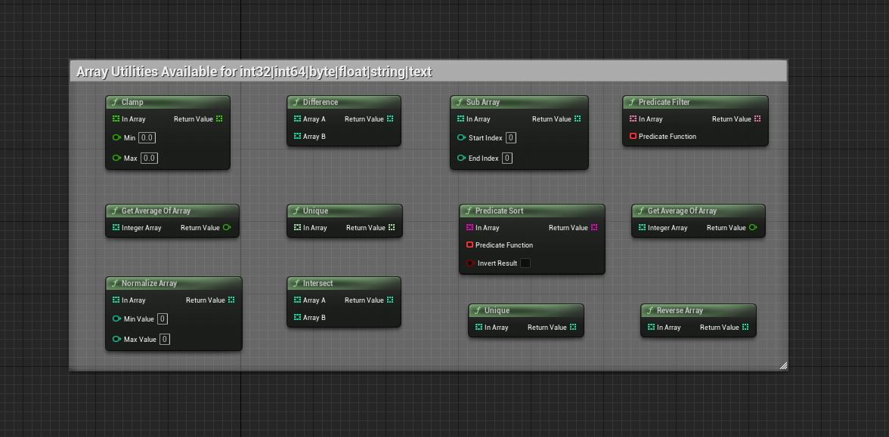

Array Util Library
==================

GET AVERAGE OF ARRAY
--------------------

**Input Parameter:**

* IntegerArray (const TArray<int32>&): An array of integers.
* FloatArray (const TArray<float>&): An array of floating-point numbers.
* ByteArray (const TArray<uint8>&): An array of unsigned 8-bit integers.
* Integer64Array (const TArray<int64>&): An array of 64-bit integers.

**Return Value:**

float - The average value of the elements in the input array.

**Function Purpose:**

This method calculates and returns the average value of the elements in the input array. The average value is always returned as a floating-point number (float).

GET INDEX OF MINIMUM
--------------------

<...continue as with "GET AVERAGE OF ARRAY" for each function...>

NORMALIZE ARRAY
---------------

**Input Parameters:**

* InArray (const TArray<int32>&): An array of integers.
* InArray (const TArray<float>&): An array of floating-point numbers.
* InArray (const TArray<uint8>&): An array of unsigned 8-bit integers.
* InArray (const TArray<int64>&): An array of 64-bit integers.
* MinValue (int32 / float / uint8 / int64): The minimum value of the normalized range.
* MaxValue (int32 / float / uint8 / int64): The maximum value of the normalized range.

**Return Value:**

TArray<int32> / TArray<float> / TArray<uint8> / TArray<int64> - The normalized array.

**Function Purpose:**

This method normalizes the elements in the input array and returns the normalized array.

GET AVERAGE OF ARRAY
--------------------

**Input Parameter:**

* IntegerArray (const TArray<int32>&): An array of integers.
* FloatArray (const TArray<float>&): An array of floating-point numbers.
* ByteArray (const TArray<uint8>&): An array of unsigned 8-bit integers.
* Integer64Array (const TArray<int64>&): An array of 64-bit integers.

**Return Value:**

float - The average value of the elements in the input array.

**Function Purpose:**

This method calculates and returns the average value of the elements in the input array. The average value is always returned as a floating-point number (float).

GET INDEX OF MINIMUM
--------------------

**Input Parameters:**

* IntegerArray (const TArray<int32>&): An array of integers.
* FloatArray (const TArray<float>&): An array of floating-point numbers.
* ByteArray (const TArray<uint8>&): An array of unsigned 8-bit integers.
* Integer64Array (const TArray<int64>&): An array of 64-bit integers.
* bUseAbsoluteValues (bool): A flag indicating whether to use absolute values for comparison.

**Return Value:**

int32 - The index of the minimum value in the input array.

**Function Purpose:**

This method calculates and returns the index of the minimum value in the input array.

GET INDEX OF MAXIMUM
--------------------

**Input Parameters:**

* IntegerArray (const TArray<int32>&): An array of integers.
* FloatArray (const TArray<float>&): An array of floating-point numbers.
* ByteArray (const TArray<uint8>&): An array of unsigned 8-bit integers.
* Integer64Array (const TArray<int64>&): An array of 64-bit integers.
* bUseAbsoluteValues (bool): A flag indicating whether to use absolute values for comparison.

**Return Value:**

int32 - The index of the maximum value in the input array.

**Function Purpose:**

This method calculates and returns the index of the maximum value in the input array.

NORMALIZE ARRAY
---------------

**Input Parameters:**

* InArray (const TArray<int32>&): An array of integers.
* InArray (const TArray<float>&): An array of floating-point numbers.
* InArray (const TArray<uint8>&): An array of unsigned 8-bit integers.
* InArray (const TArray<int64>&): An array of 64-bit integers.
* MinValue (int32 / float / uint8 / int64): The minimum value of the normalized range.
* MaxValue (int32 / float / uint8 / int64): The maximum value of the normalized range.

**Return Value:**

TArray<int32> / TArray<float> / TArray<uint8> / TArray<int64> - The normalized array.

**Function Purpose:**

This method normalizes the elements in the input array and returns the normalized array.

REVERSE ARRAY
-------------

**Input Parameters:**

* InArray (const TArray<int32>&): An array of integers.
* InArray (const TArray<int64>&): An array of 64-bit integers.
* InArray (const TArray<float>&): An array of floating-point numbers.
* InArray (const TArray<uint8>&): An array of unsigned 8-bit integers.
* InArray (const TArray<FString>&): An array of strings.
* InArray (const TArray<FText>&): An array of text objects.

**Return Value:**

TArray<int32> / TArray<int64> / TArray<float> / TArray<uint8> / TArray<FString> / TArray<FText> - The reversed array.

**Function Purpose:**

This method reverses the order of elements in the input array and returns the reversed array.

SUBARRAY
--------

**Input Parameters:**

* InArray (const TArray<int32>&): An array of integers.
* InArray (const TArray<float>&): An array of floating-point numbers.
* InArray (const TArray<int64>&): An array of 64-bit integers.
* InArray (const TArray<uint8>&): An array of unsigned 8-bit integers.
* InArray (const TArray<FString>&): An array of strings.
* InArray (const TArray<FText>&): An array of text objects.
* StartIndex (int32): The starting index of the subarray.
* EndIndex (int32): The ending index of the subarray.

**Return Value:**

TArray<int32> / TArray<float> / TArray<int64> / TArray<uint8> / TArray<FString> / TArray<FText> - The subarray.

**Function Purpose:**

This method extracts a subarray from the input array based on the specified StartIndex and EndIndex values and returns the subarray.

PREDICATE SORT
--------------

**Input Parameters:**

* InArray (const TArray<int32>&): An array of integers.
* InArray (const TArray<float>&): An array of floating-point numbers.
* InArray (const TArray<int64>&): An array of 64-bit integers.
* InArray (const TArray<uint8>&): An array of unsigned 8-bit integers.
* InArray (const TArray<FString>&): An array of strings.
* InArray (const TArray<FText>&): An array of text objects.
* PredicateFunction (FInt32PredicateDelegate / FFloatPredicateDelegate / FInt64PredicateDelegate / FUint8PredicateDelegate / FStringPredicateDelegate / FTextPredicateDelegate): A predicate function delegate that compares two elements and returns a boolean result.
* InvertResult (bool): Indicates whether the result of the predicate function should be inverted.

**Return Value:**

TArray<int32> / TArray<float> / TArray<int64> / TArray<uint8> / TArray<FString> / TArray<FText> - The sorted array based on the predicate function.

**Function Purpose:**

This method performs a predicate-based sort on the input array and returns the sorted array.

PREDICATE FILTER
----------------

**Input Parameters:**

* InArray (const TArray<int32>&): An array of integers.
* InArray (const TArray<float>&): An array of floating-point numbers.
* InArray (const TArray<int64>&): An array of 64-bit integers.
* InArray (const TArray<uint8>&): An array of unsigned 8-bit integers.
* InArray (const TArray<FString>&): An array of strings.
* InArray (const TArray<FText>&): An array of text objects.
* PredicateFunction (FInt32FilterDelegate / FFloatFilterDelegate / FInt64FilterDelegate / FUint8FilterDelegate / FStringFilterDelegate / FTextFilterDelegate): A predicate function delegate that filters elements and returns a boolean result.

**Return Value:**

TArray<int32> / TArray<float> / TArray<int64> / TArray<uint8> / TArray<FString> / TArray<FText> - The filtered array based on the predicate function.

**Function Purpose:**

This method filters the elements of the input array based on a predicate function and returns the filtered array.

INTERPOLATE
-----------

**Input Parameters:**

* InArray (const TArray<T>&): The input array.
* Time (float): The interpolation time value.
* bUseSmoothInterpolation (bool): Determines whether to use smooth interpolation.

**Return Value:**

T - The interpolated value.

**Function Purpose:**

The Interpolate function performs interpolation on an input array of elements and returns the interpolated value.

INTERSECT
---------

**Input Parameters:**

* ArrayA (const TArray<int32>&): The first array of integers.
* ArrayA (const TArray<float>&): The first array of floating-point numbers.
* ArrayA (const TArray<int64>&): The first array of 64-bit integers.
* ArrayA (const TArray<uint8>&): The first array of unsigned 8-bit integers.
* ArrayA (const TArray<FString>&): The first array of strings.
* ArrayA (const TArray<FText>&): The first array of text objects.
* ArrayB (const TArray<int32>&): The second array of integers.
* ArrayB (const TArray<float>&): The second array of floating-point numbers.
* ArrayB (const TArray<int64>&): The second array of 64-bit integers.
* ArrayB (const TArray<uint8>&): The second array of unsigned 8-bit integers.
* ArrayB (const TArray<FString>&): The second array of strings.
* ArrayB (const TArray<FText>&): The second array of text objects.

**Return Value:**

TArray<int32> / TArray<float> / TArray<int64> / TArray<uint8> / TArray<FString> / TArray<FText> - The intersection of ArrayA and ArrayB.

**Function Purpose:**

This method calculates the intersection of two arrays, ArrayA and ArrayB.

UNIQUE
------

**Input Parameters:**

* InArray (const TArray<int32>&): The input array of integers.
* InArray (const TArray<float>&): The input array of floating-point numbers.
* InArray (const TArray<int64>&): The input array of 64-bit integers.
* InArray (const TArray<uint8>&): The input array of unsigned 8-bit integers.
* InArray (const TArray<FString>&): The input array of strings.
* InArray (const TArray<FText>&): The input array of text objects.

**Return Value:**

TArray<int32> / TArray<float> / TArray<int64> / TArray<uint8> / TArray<FString> / TArray<FText> - The unique elements in the input array.

**Function Purpose:**

This method returns an array containing the unique elements from the input array.

DIFFERENCE
----------

**Input Parameters:**

* ArrayA (const TArray<int32>&): The first array of integers.
* ArrayA (const TArray<float>&): The first array of floating-point numbers.
* ArrayA (const TArray<int64>&): The first array of 64-bit integers.
* ArrayA (const TArray<uint8>&): The first array of unsigned 8-bit integers.
* ArrayA (const TArray<FString>&): The first array of strings.
* ArrayA (const TArray<FText>&): The first array of text objects.
* ArrayB (const TArray<int32>&): The second array of integers.
* ArrayB (const TArray<float>&): The second array of floating-point numbers.
* ArrayB (const TArray<int64>&): The second array of 64-bit integers.
* ArrayB (const TArray<uint8>&): The second array of unsigned 8-bit integers.
* ArrayB (const TArray<FString>&): The second array of strings.
* ArrayB (const TArray<FText>&): The second array of text objects.

**Return Value:**

TArray<int32> / TArray<float> / TArray<int64> / TArray<uint8> / TArray<FString> / TArray<FText> - The difference between ArrayA and ArrayB.

**Function Purpose:**

This method calculates the difference between two arrays, ArrayA and ArrayB.

CLAMP
-----

**Input Parameters:**

* InArray (const TArray<int32>&): The input array of integers.
* InArray (const TArray<float>&): The input array of floating-point numbers.
* InArray (const TArray<uint8>&): The input array of unsigned 8-bit integers.
* InArray (const TArray<int64>&): The input array of 64-bit integers.
* InArray (const TArray<FVector>&): The input array of 3D vectors.
* Min (int32 / float / uint8 / int64): The minimum value to clamp the elements to.
* Max (int32 / float / uint8 / int64): The maximum value to clamp the elements to.
* MinSize (float): The minimum size to clamp the vectors to.
* MaxSize (float): The maximum size to clamp the vectors to.
* Only2D (bool): Determines whether clamping should be applied only to the 2D components of the vectors.

**Return Value:**

TArray<int32> / TArray<float> / TArray<uint8> / TArray<int64> / TArray<FVector> - The clamped elements or vectors.

**Function Purpose:**

This method clamps the elements or vectors in the input array, InArray, to the specified minimum and maximum values.

For int32, float, uint8, and int64 arrays, the method uses the UArrayUtilLibraryGeneric class to perform the clamping operation. Each element in the array is checked against the provided minimum and maximum values, and if it exceeds those bounds, it is clamped to the nearest limit.

For FVector arrays, the method iterates through the elements of InArray and applies clamping based on the specified parameters. If the Only2D flag is set to true, the clamping is applied only to the X and Y components of the vectors, while the Z component remains unchanged. The size of each vector is also clamped between the provided MinSize and MaxSize values. The resulting clamped vectors are added to the output array, which is then returned.

