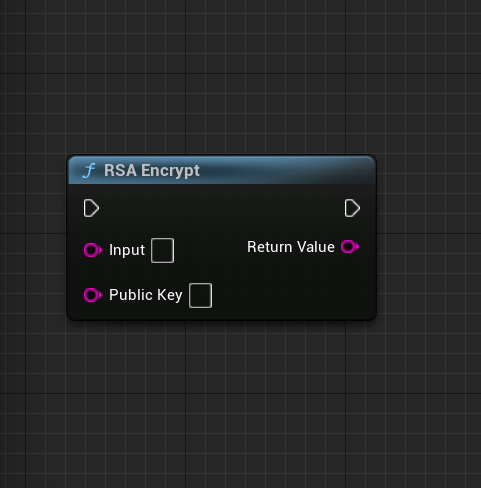
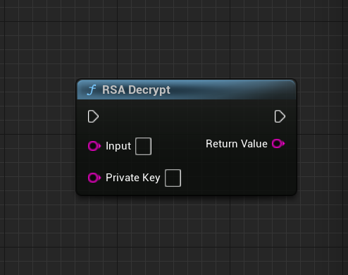

================================
Asymmetric Crypto Library
================================

The Asymmetric Crypto Library is a component of EssentialCPP that provides RSA encryption and decryption functionalities.

RSA Encrypt
-------------------

This function encrypts the input data using RSA encryption and the provided public key. It first converts the public key to a BIO object, reads the public key, and then encrypts the input data using the RSA_PKCS1_PADDING scheme. The resulting encrypted output is returned as a string.

* **Input Parameters:**
  - *Input*: The input data to be encrypted as an FString.
  - *PublicKey*: The public key used for encryption as an FString.

* **Return Value:**
  - An FString containing the encrypted output, or an empty FString if an error occurs.

RSA Decrypt
-------------------

The RSA_Decrypt function decrypts the input data using RSA decryption with the provided private key. It first decodes the input from Base64, reads the private key, and then performs the RSA decryption using RSA_PKCS1_PADDING scheme. The decrypted output is returned as an FString.

* **Input Parameters:**
  - *Input*: The input data to be decrypted, provided as an FString.
  - *PrivateKey*: The private key used for decryption, provided as an FString.

* **Return Value:**
  - An FString containing the decrypted output, or an empty FString if an error occurs.

RSA Generate Key Pair
----------------------------

This function is part of the UASymmetricCryptoLibrary. It is used to generate a key pair for the RSA asymmetric encryption algorithm. The function takes a KeySize parameter to specify the desired size of the key. It generates an RSA key pair using the specified key size and stores the resulting public and private keys in the provided PublicKey and PrivateKey variables, respectively. The keys are converted to strings using the PEM format and stored as FString objects. If an error occurs during key generation, the function sets both PublicKey and PrivateKey to empty strings.

* **Input Parameters:**
  - *KeySize (int32)*: The size of the key to be generated.

* **Return Value:**
  - *PublicKey (FString&)*: The generated public key as a string.
  - *PrivateKey (FString&)*: The generated private key as a string.
