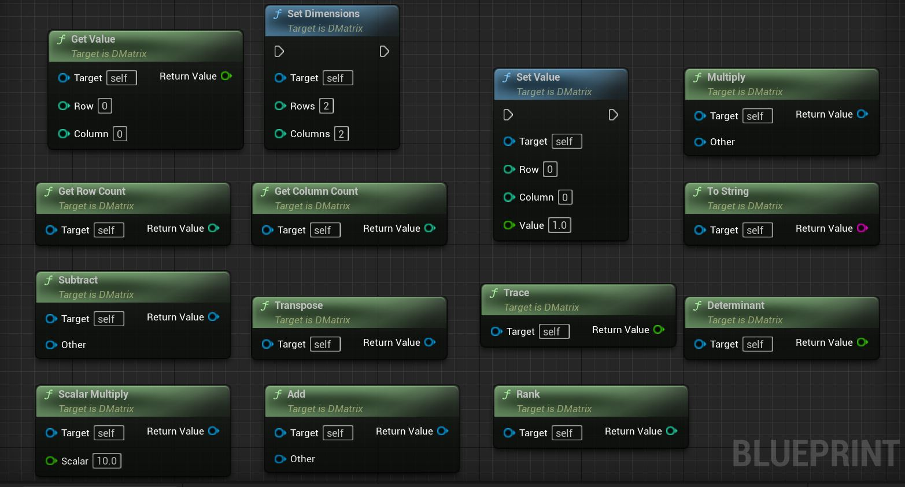
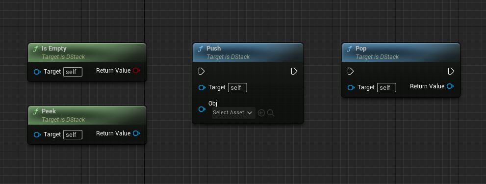
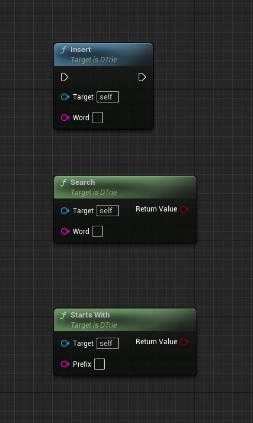

================================
Matrix
================================

SetDimensions
---------------------------

Sets the dimensions (number of rows and columns) of the matrix.

* **Input Parameters:**
  - *Rows*: The number of rows in the matrix.
  - *Columns*: The number of columns in the matrix.

* **Return Value:**
  - None.

SetValue
---------------------------

Sets the value at a specific position in the matrix.

* **Input Parameters:**
  - *Row*: The row index of the position.
  - *Column*: The column index of the position.
  - *Value*: The value to be set.

* **Return Value:**
  - None.

GetValue
---------------------------

Retrieves the value at a specific position in the matrix.

* **Input Parameters:**
  - *Row*: The row index of the position.
  - *Column*: The column index of the position.

* **Return Value:**
  - The value at the specified position.

GetRowCount
---------------------------

Returns the number of rows in the matrix.

* **Input Parameters:**
  - None.

* **Return Value:**
  - The number of rows in the matrix.

GetColumnCount
---------------------------

Returns the number of columns in the matrix.

* **Input Parameters:**
  - None.

* **Return Value:**
  - The number of columns in the matrix.

ToString
---------------------------

Converts the matrix to a string representation.

* **Input Parameters:**
  - None.

* **Return Value:**
  - A string representation of the matrix.

Add
---------------------------

Performs matrix addition with another matrix.

* **Input Parameters:**
  - *Other*: The matrix to be added.

* **Return Value:**
  - A new matrix resulting from the addition.

Subtract
---------------------------

Performs matrix subtraction with another matrix.

* **Input Parameters:**
  - *Other*: The matrix to be subtracted.

* **Return Value:**
  - A new matrix resulting from the subtraction.

Multiply
---------------------------

Performs matrix multiplication with another matrix.

* **Input Parameters:**
  - *Other*: The matrix to be multiplied.

* **Return Value:**
  - A new matrix resulting from the multiplication.

Transpose
---------------------------

Returns the transpose of the matrix.

* **Input Parameters:**
  - None.

* **Return Value:**
  - A new matrix representing the transpose.

Determinant
---------------------------

Calculates the determinant of the matrix.

* **Input Parameters:**
  - None.

* **Return Value:**
  - The determinant of the matrix.

ScalarMultiply
---------------------------

Multiplies the matrix by a scalar value.

* **Input Parameters:**
  - *Scalar*: The scalar value to multiply the matrix by.

* **Return Value:**
  - A new matrix resulting from the scalar multiplication.

Trace
---------------------------

Calculates the trace of the matrix.

* **Input Parameters:**
  - None.

* **Return Value:**
  - The trace of the matrix.

Rank
---------------------------

Calculates the rank of the matrix.

* **Input Parameters:**
  - None.

* **Return Value:**
  - The rank of the matrix.

================================
Stack
================================

Push
---------------------------

Adds an object to the top of the stack.

* **Input Parameters:**
  - *Obj*: The object to be pushed onto the stack.

* **Return Value:**
  - None.

Pop
---------------------------

Removes and returns the object from the top of the stack.

* **Input Parameters:**
  - None.

* **Return Value:**
  - The object that was removed from the top of the stack.

Peek
---------------------------

Returns the object at the top of the stack without removing it.

* **Input Parameters:**
  - None.

* **Return Value:**
  - The object at the top of the stack.

IsEmpty
---------------------------

Checks if the stack is empty.

* **Input Parameters:**
  - None.

* **Return Value:**
  - A boolean indicating whether the stack is empty.

================================
Trie
================================

Functions:
---------------------------

Insert
---------------------------

Inserts a word into the trie.

* **Input Parameters:**
  - *Word*: The word to be inserted.

* **Return Value:**
  - None.

Search
---------------------------

Searches for a word in the trie.

* **Input Parameters:**
  - *Word*: The word to search for.

* **Return Value:**
  - A boolean indicating whether the word is present in the trie.

StartsWith
---------------------------

Checks if there is any word in the trie that starts with a given prefix.

* **Input Parameters:**
  - *Prefix*: The prefix to check.

* **Return Value:**
  - A boolean indicating whether there is a word in the trie that starts with the given prefix.
