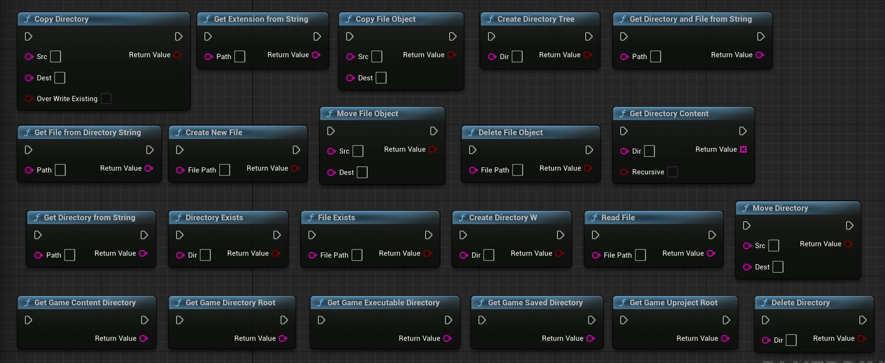

File Library
============

Copy Directory
--------------

Description:
This method copies a directory from the source path to the destination path. It uses the IPlatformFile interface to perform the directory copy operation.

Input Parameters:
- Src (const FString&): The source path of the directory to be copied.
- Dest (const FString&): The destination path where the directory will be copied.
- bOverWriteExisting (const bool): Specifies whether to overwrite existing files in the destination directory if they have the same name as files in the source directory.

Return Value:
- Success (bool): Indicates whether the directory copy operation was successful.

Copy File Object
----------------

Description:
This method copies a file from the source path to the destination path. It uses the IPlatformFile interface to perform the file copy operation.

Input Parameters:
- Src (const FString&): The source path of the file to be copied.
- Dest (const FString&): The destination path where the file will be copied.

Return Value:
- Success (bool): Indicates whether the file copy operation was successful.

Create DirectoryW
-----------------

Description:
This method creates a new directory at the specified path. It uses the IPlatformFile interface to perform the directory creation operation.

Input Parameters:
- Dir (const FString&): The path of the directory to be created.

Return Value:
- Success (bool): Indicates whether the directory creation operation was successful.

Create Directory Tree
---------------------

Description:
This method creates a directory tree (including parent directories) at the specified path. It uses the IPlatformFile interface to perform the directory tree creation operation.

Input Parameters:
- Dir (const FString&): The path of the directory tree to be created.

Return Value:
- Success (bool): Indicates whether the directory tree creation operation was successful.

Create New File
---------------

Description:
This method creates a new empty file at the specified path. It uses FFileHelper::SaveStringToFile to save an empty string to the file.

Input Parameters:
- FilePath (const FString&): The path of the file to be created.

Return Value:
- Success (bool): Indicates whether the file creation operation was successful.

Delete Directory
----------------

Description:
This method deletes a directory at the specified path. It uses the IPlatformFile interface to perform the directory deletion operation.

Input Parameters:
- Dir (const FString&): The path of the directory to be deleted.

Return Value:
- Success (bool): Indicates whether the directory deletion operation was successful.

Delete File Object
------------------

Description:
This method deletes a file at the specified path. It uses the IPlatformFile interface to perform the file deletion operation.

Input Parameters:
- FilePath (const FString&): The path of the file to be deleted.

Return Value:
- Success (bool): Indicates whether the file deletion operation was successful.

Directory Exists
----------------

Description:
This method checks if a directory exists at the specified path. It uses the IPlatformFile interface to perform the directory existence check.

Input Parameters:
- Dir (const FString&): The path of the directory to be checked.

Return Value:
- Exists (bool): Indicates whether the directory exists.

File Exists
-----------

Description:
This method checks if a file exists at the specified path. It uses the IPlatformFile interface to perform the file existence check.

Input Parameters:
- FilePath (const FString&): The path of the file to be checked.

Return Value:
- Exists (bool): Indicates whether the file exists.

Get Directory Content
---------------------

Description:
This method retrieves the content (files and directories) of a directory at the specified path. It uses the IPlatformFile interface to perform the directory content retrieval.

Input Parameters:
- Dir (const FString&): The path of the directory to retrieve the content from.
- bRecursive (bool): Specifies whether to retrieve the content recursively, including subdirectories.

Return Value:
- FileList (TArray<FString>): An array of strings representing the content (files and directories) of the specified directory.

Get Directory And File From String
---------------------------------

Description:
This method extracts the directory and file name from a given path and returns the combined string. It uses FPaths::GetPath to retrieve the directory part of the path.

Input Parameters:
- Path (const FString&): The path from which to extract the directory and file name.

Return Value:
- DirectoryAndFile (FString): The combined string representing the directory and file name.

Get Directory From String
-------------------------

Description:
This method extracts the directory part from a given path and returns it. It uses FPaths::GetPath to retrieve the directory part of the path.

Input Parameters:
- Path (const FString&): The path from which to extract the directory.

Return Value:
- Directory (FString): The directory part of the path.

Get Extension From String
-------------------------

Description:
This method extracts the file extension from a given path and returns it. It uses FPaths::GetExtension to retrieve the file extension.

Input Parameters:
- Path (const FString&): The path from which to extract the file extension.

Return Value:
- Extension (FString): The file extension.

Get File From Directory String
-----------------------------

Description:
This method extracts the file name from a given directory path and returns it. It uses FPaths::GetCleanFilename to retrieve the file name.

Input Parameters:
- Path (const FString&): The directory path from which to extract the file name.

Return Value:
- FileName (FString): The file name.

Get Game Content Directory
--------------------------

Description:
This method retrieves the directory path to the game's content directory. It uses FPaths::ProjectContentDir to retrieve the path.

Return Value:
- GameContentDirectory (FString): The directory path to the game's content directory.

Get Game Directory Root
-----------------------

Description:
This method retrieves the root directory path of the game. It uses FPaths::ProjectDir to retrieve the path.

Return Value:
- GameDirectoryRoot (FString): The root directory path of the game.

Get Game Executable Directory
-----------------------------

Description:
This method retrieves the directory path to the game's executable file. It uses FPaths::ProjectDir to retrieve the path and appends the "Binaries" subdirectory.

Return Value:
- GameExecutableDirectory (FString): The directory path to the game's executable file.

Get Game Saved Directory
------------------------

Description:
This method retrieves the directory path where the game's saved data is stored. It uses FPaths::ProjectSavedDir to retrieve the path.

Return Value:
- GameSavedDirectory (FString): The directory path where the game's saved data is stored.

Get Game Uproject Root
----------------------

Description:
This method retrieves the root directory path of the game's .uproject file. It uses FPaths::GetProjectFilePath to retrieve the path and then extracts the directory part using FPaths::GetPath.

Return Value:
- GameUprojectRoot (FString): The root directory path of the game's .uproject file.

Move Directory
--------------

Description:
This method moves a directory from the source path to the destination path. It first copies the directory using PlatformFile.CopyDirectoryTree and then deletes the source directory using PlatformFile.DeleteDirectory.

Input Parameters:
- Src (const FString&): The source path of the directory to be moved.
- Dest (const FString&): The destination path where the directory will be moved.

Return Value:
- Success (bool): Indicates whether the directory move operation was successful.

Move File Object
----------------

Description:
This method moves a file from the source path to the destination path. It first copies the file using PlatformFile.CopyFile and then deletes the source file using PlatformFile.DeleteFile.

Input Parameters:
- Src (const FString&): The source path of the file to be moved.
- Dest (const FString&): The destination path where the file will be moved.

Return Value:
- Success (bool): Indicates whether the file move operation was successful.

Read File
---------

Description:
This method reads the contents of a file at the specified path and returns them as a string. It uses FFileHelper::LoadFileToString to load the file contents.

Input Parameters:
- FilePath (const FString&): The path of the file to be read.

Return Value:
- FileContents (FString): The contents of the file as a string.
