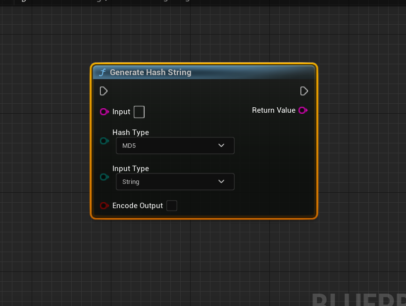

================================
Message Digest Library
================================

This feature of EssentialCPP provides a method to generate hash values for your data. It is flexible and can handle both string and file inputs. 

Generate Hash String
---------------------------

The purpose of this function is to provide a convenient way to generate hash values by abstracting the specific hash algorithm and input type. It handles both string and file inputs by appropriately reading the file contents if the InputType is EInputType::File. It then dispatches the hash generation to the respective hash function based on the specified HashType. The bEncodeOutput flag determines whether the output is Base64 encoded or not.

* **Input Parameters:**
  - *Input*: The input data as an FString or the path to a file, depending on the InputType.
  - *HashType*: The type of hash algorithm to use (EHashType enum).
  - *InputType*: Specifies whether the input is provided as a string or a file (EInputType::String or EInputType::File).
  - *bEncodeOutput*: Indicates whether the output should be Base64 encoded (true) or not (false).

* **Return Value:**
  - An FString containing the generated hash value, or an empty FString if an error occurs.

Supported Hash Types: 
-------------------------------
MD5,  MD5SHA1, SHA1, SHA256, SHA256, SHA384, SHA512_224, Blake2B_512, Blake2S_256, Ripemd_160,  SHA3_224, SHA3_256, SHA3_384, SHA3_512, SM3, SHAKE128, SHAKE256, SSL3_MD5,  SSL3_SHA1,  Whirlpool
