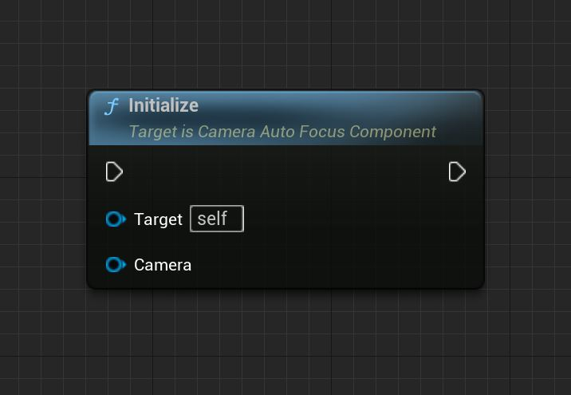
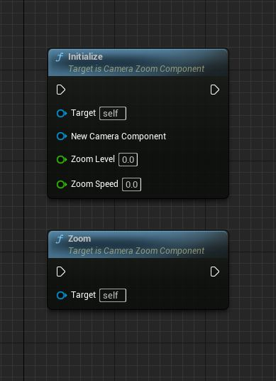
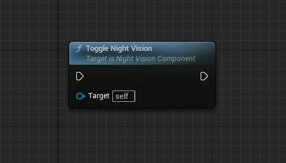
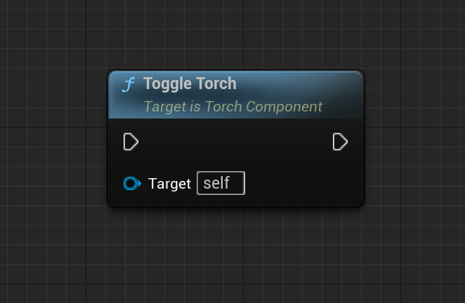

================================
Miscelleneous Features
================================

Camera Auto Focus
---------------------------

**AutoFocus**

Adjusts the camera's focus based on a line trace from the player's camera.

Input Parameters: None

Return Value: None

Functionality:
- Checks if the PlayerCamera is valid.
- Generates a line trace from the player's camera.
- Performs the line trace and stores the hit result.
- If the line trace hits a blocking object:
  - Calculates the focus distance based on the hit location.
  - Overrides the camera's depth of field focal distance and f-stop settings to achieve the desired focus effect.

Camera Zoom
---------------------------

**Initialize**

Initializes the camera zoom component with the provided camera component, initial zoom level, and zoom interpolation speed.

Input Parameters:
- NewCameraComponent: Pointer to the camera component to be used for zooming.
- ZoomLevel: The initial zoom level.
- Speed: The speed at which the zoom should interpolate.

Return Value: None

**Zoom**

Toggles the camera zoom between the initial zoom level and a single zoom stage.

Input Parameters: None

Return Value: None

Night Vision
---------------------------

**ToggleNightVision**

Toggles the night vision effect on the camera by applying the corresponding post-process settings.

Input Parameters: None

Return Value: None

Torch Component
---------------------------

**ToggleTorch**

Toggles the visibility of the torch component.

Input Parameters: None

Return Value: None
