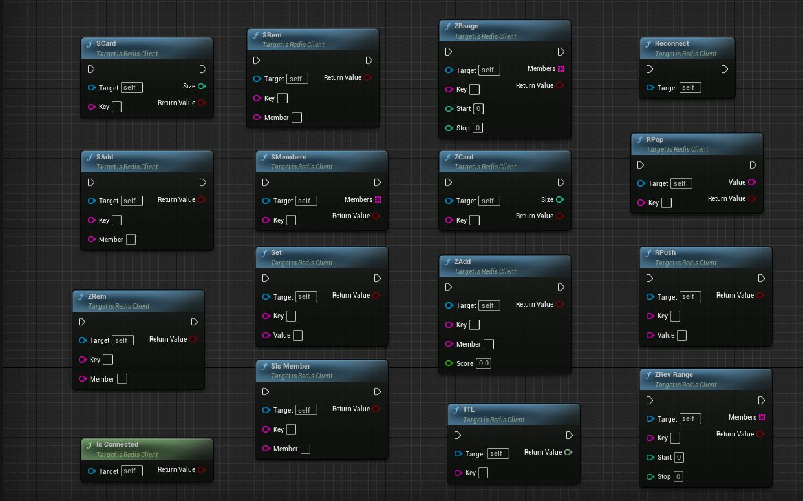
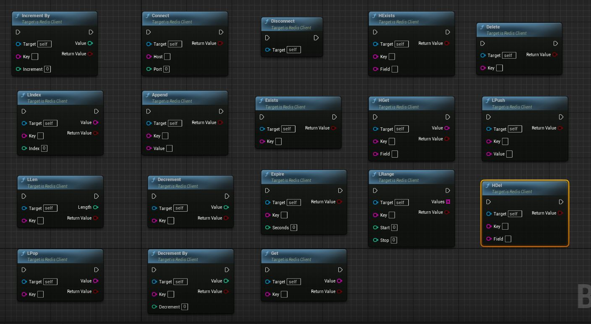

================================
Redis Library
================================

Redis is an in-memory data structure store that can be used as a database, cache, and message broker. The following functions provide a set of operations to interact with Redis using the provided library.

Connect
---------------------------

Attempts to establish a connection to the Redis server with the specified host and port.

* **Input Parameters:**
  - *Host*: The hostname or IP address of the Redis server.
  - *Port*: The port number on which the Redis server is running.

* **Return Value:**
  - A boolean indicating whether the connection was successfully established.

Disconnect
---------------------------

Closes the connection to the Redis server.

* **Input Parameters:**
  - None.

* **Return Value:**
  - None.

Reconnect
---------------------------

Closes the current connection (if any) and attempts to reconnect to the Redis server.

* **Input Parameters:**
  - None.

* **Return Value:**
  - None.

IsConnected
---------------------------

Checks if there is an active connection to the Redis server.

* **Input Parameters:**
  - None.

* **Return Value:**
  - A boolean indicating whether a connection to the Redis server is active.

Set
---------------------------

Sets the value of a key in Redis.

* **Input Parameters:**
  - *Key*: The name of the key.
  - *Value*: The value to be stored.

* **Return Value:**
  - A boolean indicating whether the operation was successful.

Get
---------------------------

Retrieves the value of a key from Redis.

* **Input Parameters:**
  - *Key*: The name of the key.
  - *Value*: The retrieved value will be stored in this output parameter.

* **Return Value:**
  - A boolean indicating whether the operation was successful.

Delete
---------------------------

Deletes a key from Redis.

* **Input Parameters:**
  - *Key*: The name of the key.

* **Return Value:**
  - A boolean indicating whether the operation was successful.

Exists
---------------------------

Checks if a key exists in Redis.

* **Input Parameters:**
  - *Key*: The name of the key.

* **Return Value:**
  - A boolean indicating whether the key exists.

Expire
---------------------------

Sets an expiration time (in seconds) for a key in Redis.

* **Input Parameters:**
  - *Key*: The name of the key.
  - *Seconds*: The number of seconds after which the key will expire.

* **Return Value:**
  - A boolean indicating whether the operation was successful.

TTL
---------------------------

Gets the remaining time to live (in seconds) of a key in Redis.

* **Input Parameters:**
  - *Key*: The name of the key.

* **Return Value:**
  - The remaining time to live of the key, or -2 if the key does not exist or has no associated expire.

Append
---------------------------

Appends a value to an existing key in Redis.

* **Input Parameters:**
  - *Key*: The name of the key.
  - *Value*: The value to be appended.

* **Return Value:**
  - A boolean indicating whether the operation was successful.

Increment
---------------------------

Increments the value of a key in Redis by 1.

* **Input Parameters:**
  - *Key*: The name of the key.
  - *Value*: The incremented value will be stored in this output parameter.

* **Return Value:**
  - A boolean indicating whether the operation was successful.

Decrement
---------------------------

Decrements the value of a key in Redis by 1.

* **Input Parameters:**
  - *Key*: The name of the key.
  - *Value*: The decremented value will be stored in this output parameter.

* **Return Value:**
  - A boolean indicating whether the operation was successful.

IncrementBy
---------------------------

Increments the value of a key in Redis by a specified amount.

* **Input Parameters:**
  - *Key*: The name of the key.
  - *Increment*: The amount by which to increment the value.
  - *Value*: The incremented value will be stored in this output parameter.

* **Return Value:**
  - A boolean indicating whether the operation was successful.

DecrementBy
---------------------------

Decrements the value of a key in Redis by a specified amount.

* **Input Parameters:**
  - *Key*: The name of the key.
  - *Decrement*: The amount by which to decrement the value.
  - *Value*: The decremented value will be stored in this output parameter.

* **Return Value:**
  - A boolean indicating whether the operation was successful.

HSet
---------------------------

Sets the value of a field in a Redis hash.

* **Input Parameters:**
  - *Key*: The name of the hash.
  - *Field*: The name of the field.
  - *Value*: The value to be set.

* **Return Value:**
  - A boolean indicating whether the operation was successful.

HGet
---------------------------

Retrieves the value of a field from a Redis hash.

* **Input Parameters:**
  - *Key*: The name of the hash.
  - *Field*: The name of the field.
  - *Value*: The retrieved value will be stored in this output parameter.

* **Return Value:**
  - A boolean indicating whether the operation was successful.

HDel
---------------------------

Deletes a field from a Redis hash.

* **Input Parameters:**
  - *Key*: The name of the hash.
  - *Field*: The name of the field.

* **Return Value:**
  - A boolean indicating whether the operation was successful.

HGetAll
---------------------------

Retrieves all fields and values from a Redis hash.

* **Input Parameters:**
  - *Key*: The name of the hash.
  - *Fields*: The retrieved fields and values will be stored in this output parameter.

* **Return Value:**
  - A boolean indicating whether the operation was successful.

HExists
---------------------------

Checks if a field exists in a Redis hash.

* **Input Parameters:**
  - *Key*: The name of the hash.
  - *Field*: The name of the field.

* **Return Value:**
  - A boolean indicating whether the field exists.

HIncrBy
---------------------------

Increments the value of a field in a Redis hash by a specified amount.

* **Input Parameters:**
  - *Key*: The name of the hash.
  - *Field*: The name of the field.
  - *Increment*: The amount by which to increment the value.
  - *Value*: The incremented value will be stored in this output parameter.

* **Return Value:**
  - A boolean indicating whether the operation was successful.

LPush
---------------------------

Inserts one or more values at the beginning of a Redis list.

* **Input Parameters:**
  - *Key*: The name of the list.
  - *Value*: The value to be inserted.

* **Return Value:**
  - A boolean indicating whether the operation was successful.

RPush
---------------------------

Inserts one or more values at the end of a Redis list.

* **Input Parameters:**
  - *Key*: The name of the list.
  - *Value*: The value to be inserted.

* **Return Value:**
  - A boolean indicating whether the operation was successful.

LPop
---------------------------

Removes and retrieves the first element from a Redis list.

* **Input Parameters:**
  - *Key*: The name of the list.
  - *Value*: The removed value will be stored in this output parameter.

* **Return Value:**
  - A boolean indicating whether the operation was successful.

RPop
---------------------------

Removes and retrieves the last element from a Redis list.

* **Input Parameters:**
  - *Key*: The name of the list.
  - *Value*: The removed value will be stored in this output parameter.

* **Return Value:**
  - A boolean indicating whether the operation was successful.

LLen
---------------------------

Gets the length of a Redis list.

* **Input Parameters:**
  - *Key*: The name of the list.
  - *Length*: The length of the list will be stored in this output parameter.

* **Return Value:**
  - A boolean indicating whether the operation was successful.

LRange
---------------------------

Retrieves a range of elements from a Redis list.

* **Input Parameters:**
  - *Key*: The name of the list.
  - *Start*: The starting index of the range.
  - *Stop*: The ending index of the range.
  - *Values*: The retrieved values will be stored in this output parameter.

* **Return Value:**
  - A boolean indicating whether the operation was successful.

LIndex
---------------------------

Retrieves an element from a Redis list by its index.

* **Input Parameters:**
  - *Key*: The name of the list.
  - *Index*: The index of the element.
  - *Value*: The retrieved value will be stored in this output parameter.

* **Return Value:**
  - A boolean indicating whether the operation was successful.

SAdd
---------------------------

Adds a member to a Redis set.

* **Input Parameters:**
  - *Key*: The name of the set.
  - *Member*: The member to be added.

* **Return Value:**
  - A boolean indicating whether the operation was successful.

SRem
---------------------------

Removes a member from a Redis set.

* **Input Parameters:**
  - *Key*: The name of the set.
  - *Member*: The member to be removed.

* **Return Value:**
  - A boolean indicating whether the operation was successful.

SCard
---------------------------

Gets the number of members in a Redis set.

* **Input Parameters:**
  - *Key*: The name of the set.
  - *Size*: The size of the set will be stored in this output parameter.

* **Return Value:**
  - A boolean indicating whether the operation was successful.

SIsMember
---------------------------

Checks if a member exists in a Redis set.

* **Input Parameters:**
  - *Key*: The name of the set.
  - *Member*: The member to be checked.

* **Return Value:**
  - A boolean indicating whether the member exists in the set.

SMembers
---------------------------

Retrieves all members of a Redis set.

* **Input Parameters:**
  - *Key*: The name of the set.
  - *Members*: The retrieved members will be stored in this output parameter.

* **Return Value:**
  - A boolean indicating whether the operation was successful.

ZAdd
---------------------------

Adds a member with a score to a Redis sorted set.

* **Input Parameters:**
  - *Key*: The name of the sorted set.
  - *Member*: The member to be added.
  - *Score*: The score associated with the member.

* **Return Value:**
  - A boolean indicating whether the operation was successful.

ZRem
---------------------------

Removes a member from a Redis sorted set.

* **Input Parameters:**
  - *Key*: The name of the sorted set.
  - *Member*: The member to be removed.

* **Return Value:**
  - A boolean indicating whether the operation was successful.

ZCard
---------------------------

Gets the number of members in a Redis sorted set.

* **Input Parameters:**
  - *Key*: The name of the sorted set.
  - *Size*: The size of the sorted set will be stored in this output parameter.

* **Return Value:**
  - A boolean indicating whether the operation was successful.

ZRange
---------------------------

Retrieves a range of members from a Redis sorted set by their scores.

* **Input Parameters:**
  - *Key*: The name of the sorted set.
  - *Start*: The starting index of the range.
  - *Stop*: The ending index of the range.
  - *Members*: The retrieved members will be stored in this output parameter.

* **Return Value:**
  - A boolean indicating whether the operation was successful.

ZRevRange
---------------------------

Retrieves a range of members from a Redis sorted set by their scores in reverse order.

* **Input Parameters:**
  - *Key*: The name of the sorted set.
  - *Start*: The starting index of the range.
  - *Stop*: The ending index of the range.
  - *Members*: The retrieved members will be stored in this output parameter.

* **Return Value:**
  - A boolean indicating whether the operation was successful.
