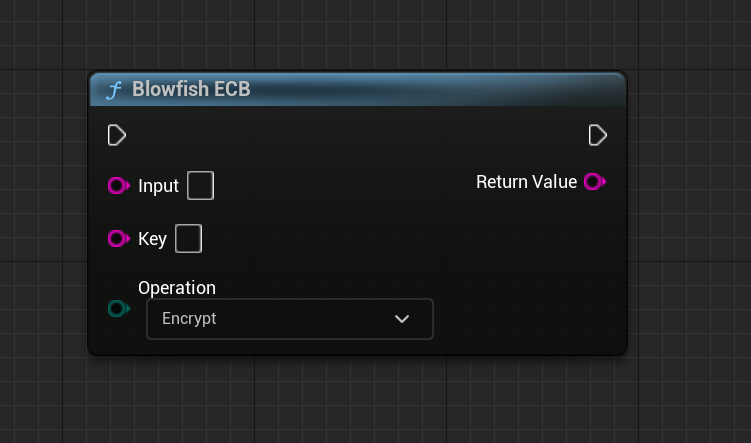
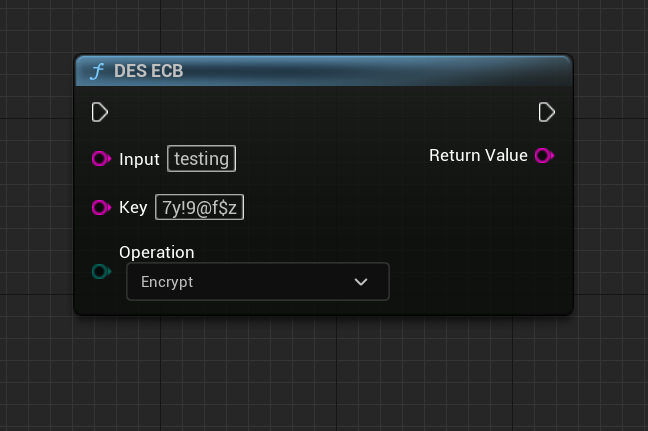

Symmetric Encryption Library
===========================

AES_ECB
-------

**Input Parameters:**

* Input (FString): The input data to be encrypted or decrypted.
* Key (FString): The encryption or decryption key.
* Algorithm (EAESAlgorithm): The AES algorithm to use.
* Operation (EOperation): The operation to perform (Encrypt or Decrypt).

**Return Value:**

The function returns a FString containing the encrypted or decrypted data. If an error occurs during the encryption or decryption process, an empty FString is returned.

**Function Purpose:**

The AES_ECB method is a convenience function that performs AES encryption or decryption using the ECB (Electronic Codebook) mode. It takes an input data and key, along with the specified AES algorithm and operation (encrypt or decrypt), and returns the resulting encrypted or decrypted output data. This method is specifically designed for ECB mode and does not require an initialization vector (IV).

AES_CBC
-------

**Input Parameters:**

* Input (FString): Input data to be encrypted or decrypted.
* Key (FString): Encryption or decryption key.
* IV (FString): Initialization vector for CBC mode.
* Algorithm (EAESAlgorithm): AES algorithm to use.
* Operation (EOperation): Operation to perform (Encrypt or Decrypt).

**Return Value:**

FString: Encrypted or decrypted output data.

**Function Purpose:**

The AES_CBC method is a convenience function that performs AES encryption or decryption using the CBC (Cipher Block Chaining) mode. It takes the input data, key, initialization vector (IV), AES algorithm, and operation as input, and returns the resulting encrypted or decrypted output data. This method is specifically designed for CBC mode and provides a simplified interface for performing AES operations with CBC mode in a secure and efficient manner.

Blowfish_ECB
------------

**Input Parameters:**

* Input (const FString&): Input data to be encrypted or decrypted.
* Key (const FString&): Encryption or decryption key.
* Operation (EOperation): Operation to perform (Encrypt or Decrypt).

**Return Value:**

FString: Encrypted or decrypted output data.

**Function Purpose:**

The Blowfish_ECB method is a convenience function that performs Blowfish encryption or decryption using the ECB (Electronic Codebook) mode. It takes the input data, key, and operation as input and returns the resulting encrypted or decrypted output data. This method is specifically designed for ECB mode and provides a simplified interface for performing Blowfish operations with ECB mode in a secure and efficient manner.

Blowfish_CBC
------------

**Input Parameters:**

* Input (const FString&): Input data to be encrypted or decrypted.
* Key (const FString&): Encryption or decryption key.
* IV (const FString&): Initialization vector for CBC mode.
* Operation (EOperation): Operation to perform (Encrypt or Decrypt).

**Return Value:**

FString: Encrypted or decrypted output data.

**Function Purpose:**

The Blowfish_CBC method is a convenience function that performs Blowfish encryption or decryption using the CBC (Cipher Block Chaining) mode. It takes the input data, key, IV, and operation as input and returns the resulting encrypted or decrypted output data. This method is specifically designed for CBC mode and provides a simplified interface for performing Blowfish operations with CBC mode in a secure and efficient manner.

DES_ECB
-------

**Input Parameters:**

* Input (const FString&): Input data to be encrypted or decrypted.
* Key (const FString&): Encryption or decryption key.
* Operation (EOperation): Operation to perform (Encrypt or Decrypt).

**Return Value:**

FString: Encrypted or decrypted output data.

**Function Purpose:**

The DES_ECB method is a convenience function that performs DES encryption or decryption using the ECB (Electronic Codebook) mode. It takes the input data, key, and operation as input and returns the resulting encrypted or decrypted output data. This method is specifically designed for ECB mode and provides a simplified interface for performing DES operations with ECB mode in a secure and efficient manner.

DES_CBC
-------

**Input Parameters:**

* Input (const FString&): Input data to be encrypted or decrypted.
* Key (const FString&): Encryption or decryption key.
* IV (const FString&): Initialization vector for CBC mode.
* Operation (EOperation): Operation to perform (Encrypt or Decrypt).

**Return Value:**

FString: Encrypted or decrypted output data.

**Function Purpose:**

The DES_CBC method is a convenience function that performs DES encryption or decryption using the CBC (Cipher Block Chaining) mode. It takes the input data, key, IV, and operation as input and returns the resulting encrypted or decrypted output data. This method is specifically designed for CBC mode and provides a simplified interface for performing DES operations with CBC mode in a secure and efficient manner.

TRIPLE DES_ECB
--------------

**Input Parameters:**

* Input: The input data to be encrypted or decrypted as an FString.
* Key: The encryption/decryption key as an FString.
* Operation: Specifies whether to perform encryption or decryption (EOperation::Encrypt or EOperation::Decrypt).

**Return Value:**

An FString containing the encrypted or decrypted result.

**Function Purpose:**

This function performs TripleDES encryption or decryption using the ECB mode of operation. It is a wrapper function that calls the main TripleDES function with the ECB mode specified. The purpose is to provide a simplified interface for performing TripleDES encryption or decryption using a specified key.

TRIPLE DES_CBC
--------------

**Input Parameters:**

* Input: The input data to be encrypted or decrypted as an FString.
* Key: The encryption/decryption key as an FString.
* IV: The initialization vector (IV) used in the CBC mode as an FString.
* Operation: Specifies whether to perform encryption or decryption (EOperation::Encrypt or EOperation::Decrypt).

**Return Value:**

An FString containing the encrypted or decrypted result.

**Function Purpose:**

This function performs TripleDES encryption or decryption using the Cipher Block Chaining (CBC) mode of operation. It is a wrapper function that calls the main TripleDES function with the CBC mode specified, along with the provided key and IV. The purpose is to provide a simplified interface for performing TripleDES encryption or decryption using a specified key and IV in CBC mode.

