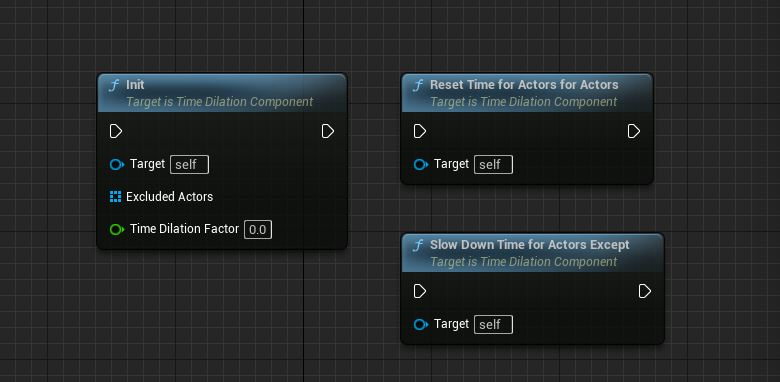
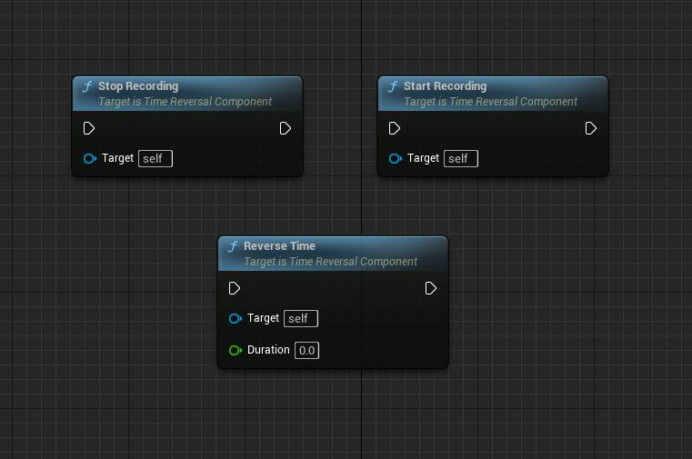

Time Dilation Component
=======================

Slow Down Time For Actors Except
--------------------------------

Description:
This method slows down the time for specific actors in the game world while maintaining normal time dilation for other actors. It first retrieves the world from the WorldContextObject and sets the global time dilation using UGameplayStatics::SetGlobalTimeDilation. If the TimeDilationFactor is less than 1, it iterates over the Actors array and applies custom time dilation to each actor using FTimerManager::SetTimer and a lambda function. The lambda function sets the Actor's CustomTimeDilation property to the inverse of TimeDilationFactor. If the TimeDilationFactor is 1 or greater, it directly sets the CustomTimeDilation property of each actor to TimeDilationFactor.

Input Parameters:
- WorldContextObject (UObject*): The context object from which to retrieve the game world.

Reset Time For Actors
---------------------

Description:
This method resets the time dilation for all actors in the game world to the default value of 1. It first retrieves the world from the WorldContextObject and sets the global time dilation to 1 using UGameplayStatics::SetGlobalTimeDilation. Then, it iterates over the Actors array and resets the CustomTimeDilation property of each actor to 1.

Input Parameters:
- WorldContextObject (UObject*): The context object from which to retrieve the game world.

Time Reversal Component
=======================

Begin Play
----------

Description:
This method is called when the component begins play in the game. It is an overridden function from the base class BeginPlay and does not have any additional implementation in this derived class.

Input Parameters:
None

Output Parameters:
None

Tick Component
--------------

Description:
This method is called every frame during the game. It is an overridden function from the base class TickComponent and handles the logic for recording the state of static mesh components based on the recording interval.

Input Parameters:
- DeltaTime (float): The time elapsed since the last frame.
- TickType (ELevelTick): The type of tick that triggered this update.
- ThisTickFunction (FActorComponentTickFunction*): Pointer to the tick function being executed.

Output Parameters:
None

Get All Static Mesh Components
------------------------------

Description:
This method retrieves all the UStaticMeshComponent instances attached to the specified Actor and returns them as an array.

Input Parameters:
- Actor (const AActor*): The actor from which to retrieve the static mesh components.

Return Type:
TArray<UStaticMeshComponent*>: An array of UStaticMeshComponent instances attached to the specified actor.

Store Current State
-------------------

Description:
This method stores the current state of the static mesh components attached to the owning actor. It retrieves all the static mesh components using GetAllStaticMeshComponents and stores their relevant data (transform, linear velocity, angular velocity, time, and physics enabled/disabled) in the StateDataLinkedList data structure.

Input Parameters:
None

Output Parameters:
None

Start Recording
---------------

Description:
This method starts the recording process by setting the bIsRecording flag to true.

Input Parameters:
None

Output Parameters:
None

Stop Recording
--------------

Description:
This method stops the recording process by setting the bIsRecording flag to false.

Input Parameters:
None

Output Parameters:
None

Reverse Time
------------

Description:
This method initiates the time reversal process. It checks if there is stored data available in the StateDataLinkedList and starts a timer to reverse the time for each stored state. The reversal progress is tracked using the ReversalProgress variable. The reversal process continues until the specified Duration is reached or there is no more stored data. Once the reversal is completed, the timers are cleared.

Input Parameters:
- Duration (float): The duration for which the time reversal should occur.

Output Parameters:
None
